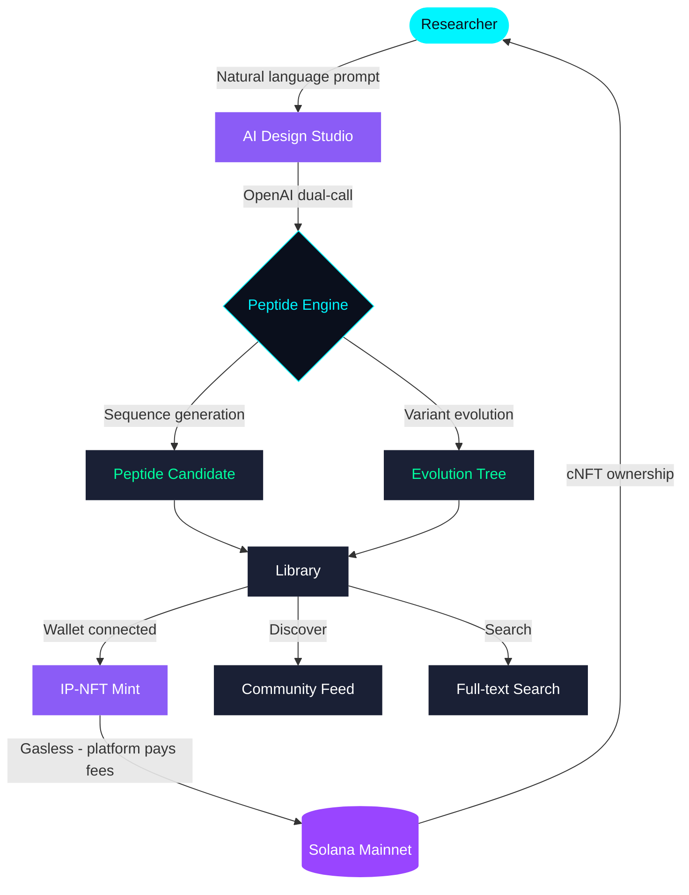
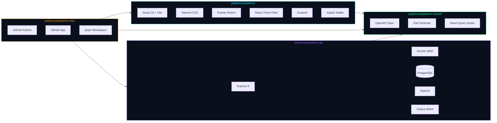
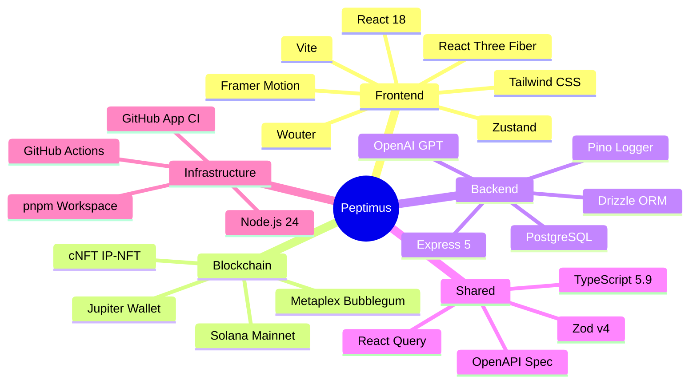
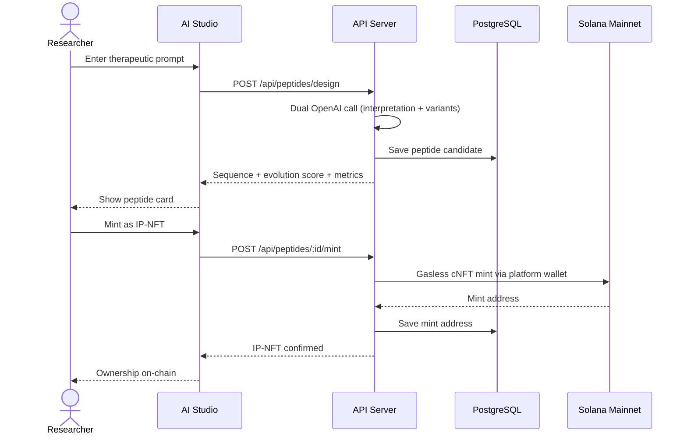
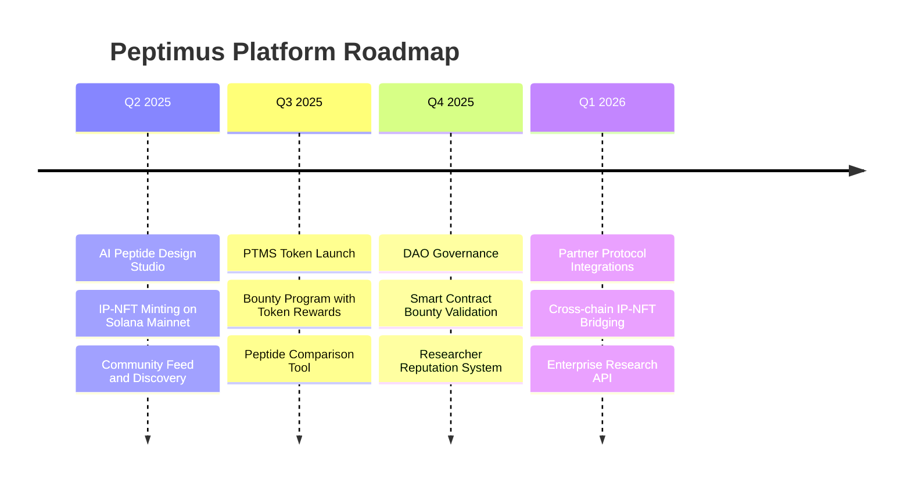

# Peptimus

**Decentralized AI Peptide Design on Solana**

---

*Design. Evolve. Own. The future of peptide research is on-chain.*

---

## What is Peptimus?

Peptimus is an AI-powered platform for peptide sequence design, evolution, and intellectual property ownership on the Solana blockchain. Researchers use natural language to design novel peptides, evolve them through AI-guided iterations, and mint them as IP-NFTs using the Molecule Protocol standard.

---

## Architecture

---

## Tech Stack

---

## Repositories

| Repository | Description | Stack |
|---|---|---|
| [peptimus](https://github.com/peptimus/peptimus) | Main web application |    |
| [peptimus-api](https://github.com/peptimus/peptimus-api) | REST API and database layer |    |
| [peptimus-shared](https://github.com/peptimus/peptimus-shared) | Shared TypeScript packages |    |
| [peptimus-infra](https://github.com/peptimus/peptimus-infra) | Monorepo root and infrastructure |   |

---

## Peptide Lifecycle

---

## Roadmap

---

**Built by [peptimusdev](https://github.com/peptimusdev)**

